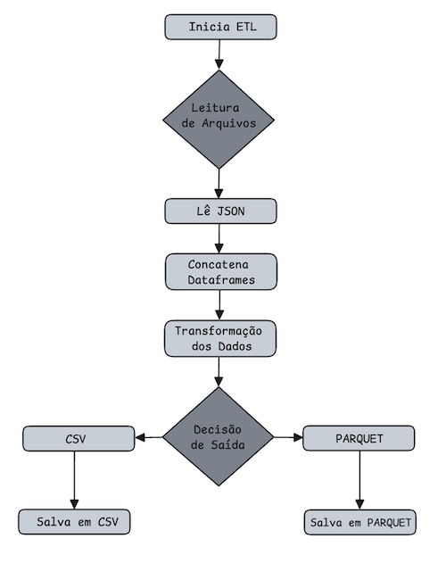

#### Pipeline ETL que lê os dados, transforma e converte para .JSON para CSV e/ou PARQUET

Objetivo: Desenvolver uma pipeline ETL que leia arquivos .JSON, transforma para Dataframe, concatena os Dataframes, 
transforma os dados pra CSV ou PARQUET.

Abaixo temos um fluxograma pra demonstrar as etapas de execução da pipeline:

 <h4>Fluxograma<h4> 

 

 **Tarefas**:

1. Ler os arquivos .JSON e carregar os dados.
2. Transformar pra Dataframe e concatenar todos os arquivos.
3. Transformar os dados
4. Decidir se vai ser salvo em CSV ou em Parquet.

**Divisão das terafas do projeto**

1. **Criar uma classe com métodos que:**:
    
* Lê os arquivos. `.lerarquivos`
* Transforma para DataFrame.`.transformardf`
* Concatena os Dataframes.`.concatenardf`
* Transforma os dados:
1. Agrupa por categoria. `.agruparcat`
2. Soma vendas totais de cada produto. `.vendastotais`
3. Filtra vendas acima de R$ 10.000,00 `.vendasup10mil`
* Converte pra CSV. `.convertercsv`
* Converte pra Parquet. `.converterparquet`
* Salva em CSV. `.salvarcsv`
* Salva em Parquet. `.salvarparquet`
